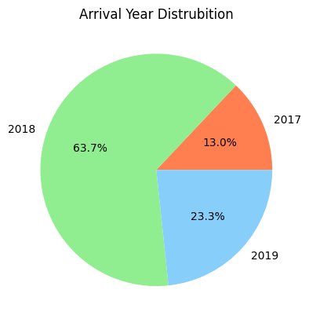
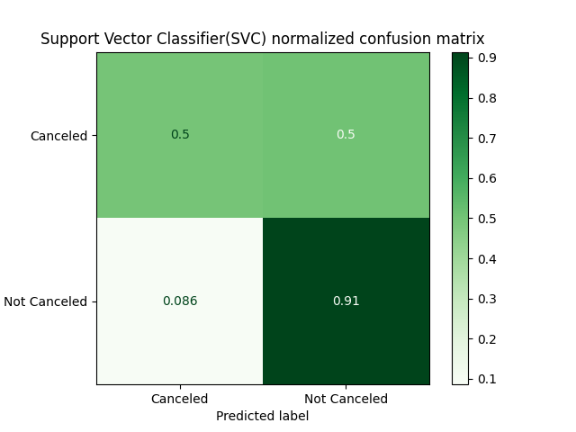

# Hotel Booking Cancellation Prediction

Data Science project for analyzing and visualizing hotel booking dataset and predicting booking status.

[Link to Kaggle Project](https://www.kaggle.com/code/aslhanyolda/hotel-booking-cancelation-prediction)
[Link to Kaggle Notebook here](./hotel-booking-cancelation-prediction.ipynb)


## Installation
Make sure you have Python installed. Clone the repository and install the required dependencies.


``` 
git clone https://github.com/AslihanYoldas/ada-lovelace-final-project.git

cd ada-lovelace-final-project.git

pip install -r requirements.txt 
```
## Usage
Run the run.py script to load dataset, data preprocessing, feauture selection, training models and visualize evulation of the models. In module folder with three module files the functions that are used in the project and the used libraries defined.

For seeing the detailed steps through projcet you can look at the notebooks. If you want to see visualization of the data yo can look at the data viz notebook. The steps are explained below with the notebook links.
``` 
python run.py
``` 
## Data
[Dataset link](https://www.kaggle.com/datasets/youssefaboelwafa/hotel-booking-cancellation-prediction) 

- Dataset contains 36k rows and 27 columns.
- Original Columns:
    - Booking_ID  *string - ID of the booking (unique)*
    - number_of_adults *int - number of adults*
    - number_of_children *int - number of children*
    - number_of_weekend_nights *int - number of weekend nights*
    - number_of_week_nights *int - number of week nights*
    - type_of_meal *category - meal type (Meal type 1, Meal Type 2, Meal Type 3, Not Selected)*
    - car_parking_space *int- car parking space (0,1)*
    - room_type *category - room type (Room Type 1, Room Type 2, Room Type 3, Room Type 4, Room Type 5, Room Type 6, Room Type 7)*
    - lead_time *int - number of days between the booking date and the arrival date*
    - market_segment_type *category - market segment type (Offline, Online, Corporate, Aviation, Complementary)*
    - repeated *int - Indicates whether the booking is a repeat booking (0,1)*
    - P_C *int - number of previous bookings that were canceled by the customer prior to the current booking*
    - P_not_C *int - number of previous bookings not canceled by the customer prior to the current booking*
    - average_price *float - average price of the booking*
    - special_requests *int - number of the special request*
    - date_of_reservation *datetime - Date of the booking*
    - booking_status *str- booking status (Canceled, Not Canceled)*
- New columns : This columns created by using existing columns 
    - reservation_day *int - day of the reservation (1-31)*
    - reservation_month *int - month of the reservation (1-12)*
    - reservation_year *int - year of the reservation (2015-2018)*
    - date_of_arrival *datetime - date of the arrival* 
    - arrival_day *int - day of the arrival (1-31)*
    - arrival_month *int - month of the arrival (1-12)*
    - arrival_year *int - year of the arrival (2016-2020)*
    - lead_month *int - number of months between the booking date and the arrival date*
    - number_of_total_nights *int - sum of week and weekend nights*
    - number_of_total_people *int - sum of adult and children*

## Data Preprocessing
[Preprocessing-notebook](/data_analyze.ipynb)
- Dataset doesn't have null values.

### Handling Outliers
#### How it detected ?
For each column thresholds determined. The low limit is the 10th percentile minus 1.5 times the range. The high limit is the 90th percentile sum 1.5 times the range. Also scatter plots created for each column. Sometimes looking to the scatter plots new thresholds determined and sometimes outliers that calculated doesn't determined as outliers. For example with the case of number of adults the algorithm detected 4 adults as outliers. Because 4 adults doesn't seem to be extreme situation detected outliers left in the dataset.

#### How it handled ?
For each outlier some other columns values compared to other data. The rows that contain some values as the outliers found. In that rows calculated the median of the that outliers' column and replace outlier with it.

Outliers detected and replaced in:
- Average Price
- Number of childeren
- Number of week nights
- Number of weekend nights
- P-C
- P-not-C
<br><br/>

 Also because there is only one row has the arrival date of 2016 and three rows has the arrival date of 2020 that rows dropped. Because of droopping these rows reservation year 2015 and 2016 also dropped.

## Data Visualazation
[Data-Viz-Notebook](/data_viz.ipynb)

- Classes are imbalanced. Most of the data is classified not cancelled.


----

- Average Price Distribution group by booking status


---
- Lead Time Distribution group by booking status
- Most of the time there are 0-2 months between reservation and arrival
- Bigger the time difference between reservation arrival date bigger rate of the cancelation


---

- Special Request Distribution group by booking status
- Most of the time there are 0-2 special request 
- More special request made lesser cancelation


----

- Mostly arrival to the hotel is in 2018 but there are also 207 and 2019 data



---

- In 2017 and 2018 Not Cancelled ratio bigger than Cancelled ratio but 2019 Canceled is more dominant


---

- There is a big increase in lead time in the bookings that have arrival date of 2019
- Because of lead time increased cancelation in 2019 is bigger than other years


---

- Corelation Heat Map
- lead time , market segment type, average price, special request,reservation year, arrival year and lead month has a correlation with booking status
- There is not a strong corelation with other variables except the obvious ones.


## Modelling

[Modelling notebook](/modelling.ipynb)

Hotel booking cancelation prediction is a classifying problem. For this task Logistic Regression model, K-Nearest Neighbour Classifier, Decision Tree Classifier, Support Vector Classifier trained and evaluated.

## Feauture Selection 

### Logistic Regression

For logistic regression a model trained with all the data and coefficents for every variable compared. Both positive and negative values higher than 0.5 are selected which are :
- special_requests
- average_price
- lead_time
- market_segment_type

### Decision Tree 
Similar to logistic regression a model trained with all tthe data and model's importance score for each variable compared. Values higher than the 0.05 are selected which are :
- lead_time
- average_price
- special_requests
- market_segment_type
- reservation day
- arrival day

### KNN and SVC
For KNN and SVC select k best with f_classif score function and Extra Tree Classifier models feaure importance score used. Both techiques returned the same features which are :
- lead_time
- average_price
- special_requests
- market_segment_type
- reservation day
- reservation month
- arrival day
- lead month
- arrival month


## Model Training
Dataset normalized and for each model spillited 80/20 ratio using selected features.

## Model Evaluation
Model Evaluation made with confusion matrix and classification reports.

- Logistic Regression
  


- KNN
  


- Decision Tree
  


- SVC
  


---

### F1 Score Table

| Model       | Cancelled   | Not Canceled |
| ----------- | ----------- | ----------
| Logistic Regression| 0.66| 0.85
| KNN   | 0.75  | 0.89
| Decision Tree   | 0.77 | 0.88
| SVC   | 0.68 | 0.87

## Results
- Not canceled class prediction is better than cancelled. It is most likely because of imbalance of classes. 
- Best canceled  prediction made with decision tree at %77 
- Best not canceled prediction made with knn at %89
- KNN and Decision Tree are the best resulted models.


## Contributing
Feel free to contribute by opening issues or submitting pull requests. 

## Contact
For questions or feedback, contact aslihanyoldas24@gmail.com
